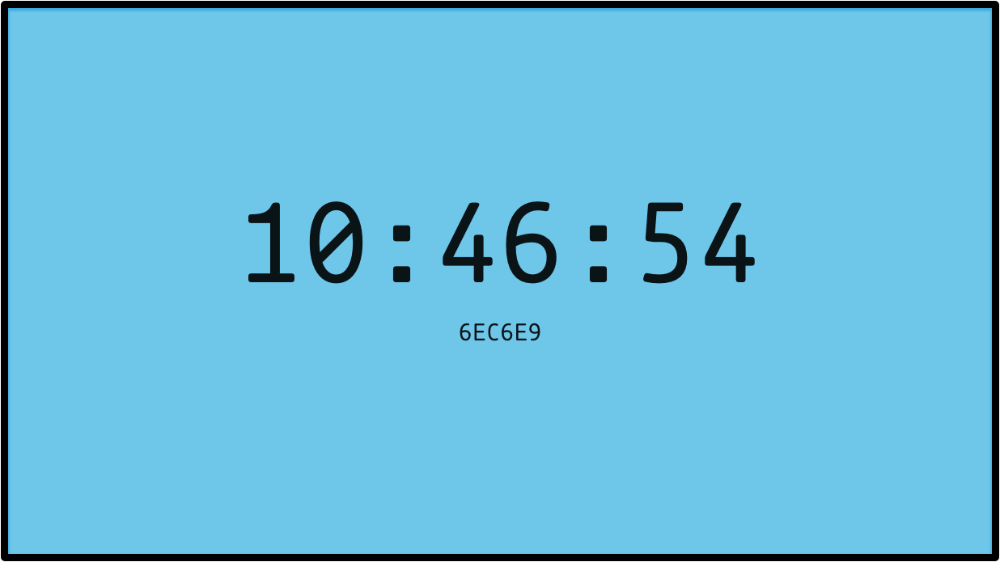

# 100 macOS Screensavers
 💻 A series of minimalist screensavers for Mac OS X

The Current Total：38 （Target：100）

## 001 - OneClock ScreenSaver

[💻Download](./screensavers/OneClock_ScreenSaver.saver.zip)

## 002 - OneClock FlipClock

[💻Download](./screensavers/OneClockFlipClock.saver.zip)

## 003 - OneClock DigitalClock

[💻Download](./screensavers/OneClockDigitalClock.saver.zip)

## 004 - OneClock DialClock

[💻Download](./screensavers/OneClockDialClock.saver.zip)

## 005 - ColorClockSaver

[💻Download](./screensavers/ColorClockSaver.saver.zip)

[🧑🏻‍💻Code](https://github.com/edwardloveall/colorclocksaver)

<!-- > Displays a solid color corresponding to the current time. -->

## 006 - ScreenMazer

[💻Download](./screensavers/ScreenMazer.zip)

[🧑🏻‍💻Source Code](https://github.com/dado3212/screenmazer)

<!-- > ScreenMazer is a screensaver for Mac that builds a maze, and then solves it, repetitively. I had this idea a while back watching some gifs of maze generation, and so I made it! -->

## 007 - Evangelion Clock Screensaver

[💻Download](./screensavers/Evangelion-Clock-1.1.1.saver.zip)

[🧑🏻‍💻Source Code](https://github.com/Wandmalfarbe/evangelion-clock-screensaver/)

<!-- > A digital clock screensaver for mac inspired by the graphical interfaces from Neon Genesis Evengelion. It displays the time in hours, minutes and seconds and is available in two styles. -->

## 008 - Aerial - Apple TV Aerial Views Screen Saver

[💻Download](https://github.com/JohnCoates/Aerial/releases/latest)

[🧑🏻‍💻Source Code](https://github.com/JohnCoates/Aerial)

<!-- > Aerial is a Mac screensaver based on the new Apple TV screensaver that displays the Aerial movies Apple shot over New York, San Francisco, Hawaii, China, etc. Starting with version 1.6, this also includes the new undersea videos available in tvOS 13! -->

## 009 - matrixgl

[💻Download](./screensavers/matrixgl.dmg)

## 010 - FractalClock

[💻Download](./screensavers/FractalClock.dmg)

[🧑🏻‍💻Source Code](https://github.com/winterbe/github-matrixhttps://github.com/phreakocious/FractalClock)

<!-- > The white arms of a simple analogue clock show the current time against a black background in this Fractal Clock screensaver for Mac OS X. As time passes, fractals grow out of these arms, continuously weaving fresh elaborate patterns on your screen. -->

## 011 - StarWarsScroll

[💻Download](./screensavers/StarWarsScroll.dmg)

## 012 - Solar Winds

[💻Download](.../Solar_Winds.dmg)

## 013 - iOS Lock Screen

[💻Download](./screensavers/iOS_Lockscreen.zip)

## 014 - Clock of Clocks

[💻Download](./screensavers/ClockOfClocks.saver.zip)

<!-- > This creative clock screensaver shows the current time in digital format using the hour and minute hands of a multitude of analog clocks placed together in a tight grid. The size of the grid changes every so often in order to show the time in a different style, and between showing the time each clock will turn its hands in a "dance" with the other clocks. The screensaver requires a macOS version upwards of 10.15 (Catalina). -->

## 015 - PongSaver

[💻Download](./screensavers/PongSaver.zip)

## 016 - Time-Saver

[💻Download](./screensavers/time-saver.zip)

## 017 - WatchScreensaver

[💻Download](./screensavers/WatchScreensaver.saver.zip)

## 018 - Filigree

[💻Download](./screensavers/Filigree.dmg)

## 019 - CircleText

[💻Download](./screensavers/CircleText.dmg)

## 020 - Life Saver

[💻Download](./screensavers/lifesaver.pkg)

##  021 - Grid Clock

[💻Download](./screensavers/GridClocksaver.zip)

[🧑🏻‍💻Source Code](https://github.com/chrstphrknwtn/grid-clock-screensaver)

##  022 - Blue Screen Saver

[💻Download](./screensavers/Blue-Screen-Saver.saver.zip)

##  023 - October30

[💻Download](./screensavers/October30.saver.zip)

[🧑🏻‍💻Source Code](https://github.com/lekevicius/october30)

## 024 - Epoch Flip Clock

[💻Download](./screensavers/Epoch.Flip.Clock.0.0.5.saver.zip)

[🧑🏻‍💻Source Code](https://github.com/chrstphrknwtn/epoch-flip-clock-screensaver)

## 025 - WhatColourIsIt

[💻Download](./screensavers/WhatColourIsIt.saver.zip)

[🧑🏻‍💻Source Code](https://github.com/Jonic/WhatColourIsIt-ScreenSaver)

## 026 - octoscreen

[💻Download](./screensavers/Octoscreen.saver.zip)

[🧑🏻‍💻Source Code](https://github.com/orderedlist/octoscreen)

## 027 - Irvue Screensaver

[💻Download](./screensavers/Irvue.Screensaver.saver.zip)

[🧑🏻‍💻Source Code](https://github.com/leonspok/Irvue-Screensaver)

## 028 - MusaicFM

[💻Download](./screensavers/MusaicFM.saver.zip)

[🧑🏻‍💻Source Code](https://github.com/docterd/MusaicFM)

## 029 - Countdown

[💻Download](./screensavers/Countdown.saver-0.1.0.zip)

[🧑🏻‍💻Source Code](https://github.com/soffes/Countdown)

## 030 - Wonderful Tools

[💻Download](./screensavers/WonderfulTools.saver.zip)

## 031 - MinimalClock

[💻Download](./screensavers/MinimalClock.saver.zip)

[🧑🏻‍💻Source Code](https://github.com/mattiarossini/MinimalClock)

## 032 - iScreenSaver

[💻Download](./screensavers/iScreenSaver.1.05.zip)

[🧑🏻‍💻Source Code](https://github.com/titman/iScreenSaver)

## 033 - Pasky-Saver

[💻Download](./screensavers/Pasky-Saver.saver.zip)

[🧑🏻‍💻Source Code](https://github.com/elpsk/PaskySaver)

## 034 - Polar Clock

[💻Download](./screensavers/Polar-Clock-Screensaver.zip)

[🧑🏻‍💻Source Code](https://github.com/MikeMcChillin/Polar-Clock-Screensaver)

## 035 - Developers Excuses

[💻Download](./screensavers/Developers-Excuses.zip)

[🧑🏻‍💻Source Code](https://github.com/ayltai/MacOS-Developers-Excuses)

## 036 - Predator

[💻Download](./screensavers/Predator.saver.zip)

[🧑🏻‍💻Source Code](https://github.com/vpeschenkov/Predator)

## 037 - Dribbble Screensaver

[💻Download](./screensavers/HotShotsScreenSaver.zip)

[🧑🏻‍💻Source Code](https://github.com/gngrwzrd/dribbble-screen-saver/)

## 038 - GitHub Matrix

[💻Download](./screensavers/GitHubMatrix.zip)

[🧑🏻‍💻Source Code](https://github.com/winterbe/github-matrix)

<!-- > The GitHub Matrix screensaver automatically downloads the most recent code commits from the open-source platform GitHub and displays the committed lines of code vertically in the style of the "digital rain" seen on computer screens in the movie The Matrix. -->

